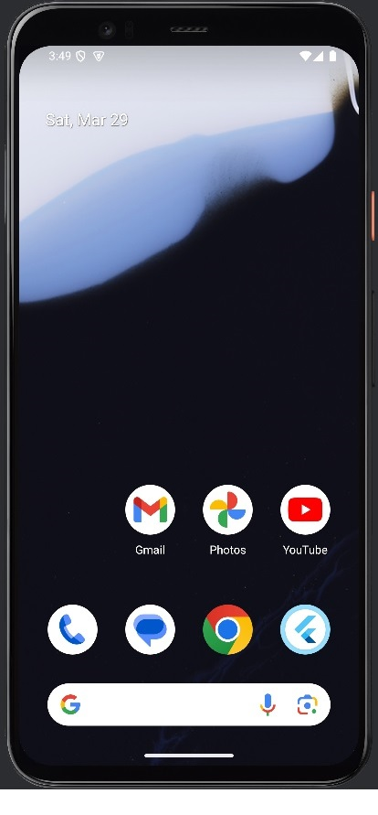
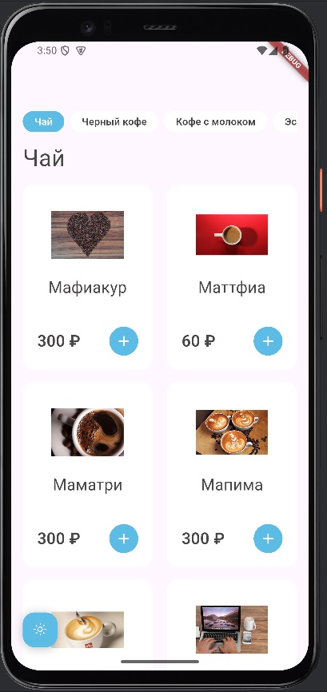
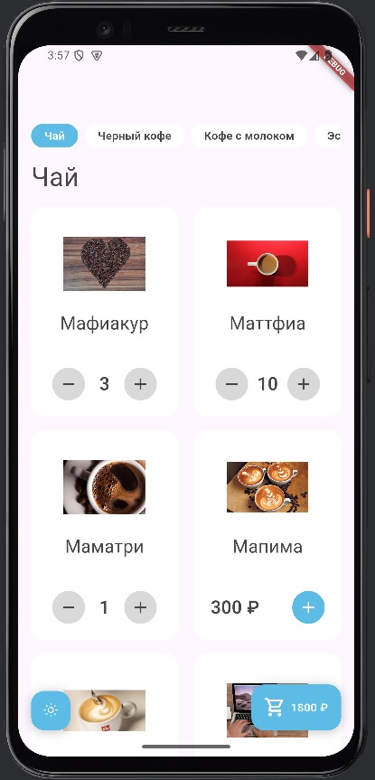
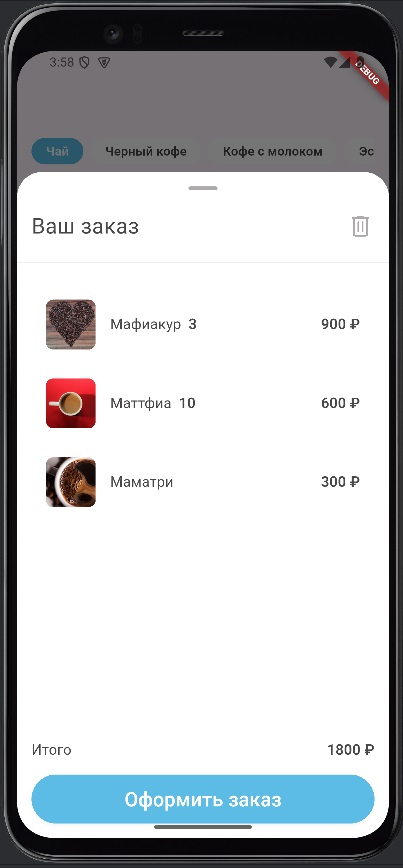

# Random_coffe_2

Test application for ordering drinks.

## [RU/ru] -

У меня была три дня и три ночи, я что-то сделал, но.... да.... но оно запускается и даже вроде работает.
Ну... 3 дня.. фишки понятное дело я не разработал (за исключением "пагинаций", которая работает по принципу НЕ загрузок картинки вовремя, а в процессе). Основные элементы (за исключением нормальной вёрстки) вроде выполнены.
Единственное, кроме, разве что, BottomSheet - потому что он всегда был на заднем плане.... Ну.. я пытался...
баги оказались силнее.

Насчёт архитектуры.... ну да... я думал обьединить BLoC, DTO, слои данных (разделение ответственности и т.д.), ну....
Да.. на BLoC я потратил часов 5, в итоге пришлось откатыватся назад и.... таких моментов было 4, МНОГО... так что
она есть... но её нет.

## В итоге:

### [x] Сверстать экраны из Figma (выберите светлую или темную тему; допускаются минимальные отличия)

### [x] Загрузку товаров из сети

### [x] Переход на карточку товара с описанием и ценой и обратно

### [x] Добавление выбранных товаров в корзину

### [x] Сохранение товаров в корзине (данные должны сохраняться и восстанавливаться после выхода из приложения)

### [x] Создание заказа из корзины

### 90% выполнено

## Скриншоты/Screenshots:

## [EN/en] -

I had three days and three nights, I did something, but.... yeah.... but it starts and even seems to work.
Well... 3 days.. I obviously didn't develop any features (except for "paginations", which work on the principle of NOT loading the image on time, but in the process). The main elements (except for normal layout) seem to be done.
The only thing, except, perhaps, BottomSheet - because it was always in the background.... Well.. I tried...
the bugs turned out to be stronger.

As for the architecture.... well yeah... I thought of combining BLoC, DTO, data layers (separation of responsibilities, etc.), well...
Yeah.. I spent about 5 hours on BLoC, in the end I had to roll back and.... there were 4 such moments, A LOT... so
it is there... but it is not there.

## In summary:

### [x] Layout screens from Figma (select a light or dark theme; minor differences are allowed)

### [x] Downloading products from the network

### [x] Going to the product card with description and price and back

### [x] Adding selected products to the cart

### [x] Saving products in the cart (data should be saved and restored after exiting the application)

### [x] Creating an order from the cart

### 90% completed

